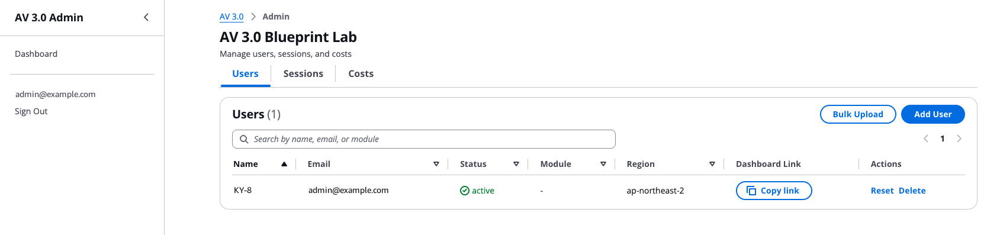
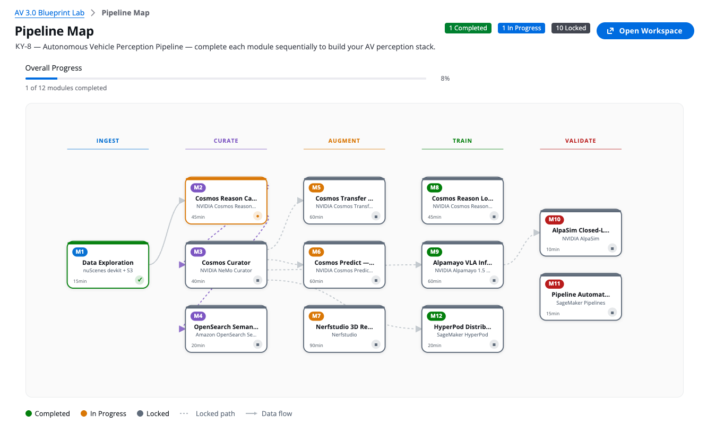

<!-- Language: [English](../en/README.md) · [한국어](../ko/README.md) · **日本語** -->

# AV 3.0 Blueprint Lab

**ドキュメント言語:** [English](../en/README.md) · [한국어](../ko/README.md) · **日本語**

[Building an End-to-End Physical AI Data Pipeline for Autonomous Vehicle 3.0 on AWS with NVIDIA](https://aws.amazon.com/blogs/industries/building-an-end-to-end-physical-ai-data-pipeline-for-autonomous-vehicle-3-0-on-aws-with-nvidia/) をハンズオンで実行するための、セルフサービス型 AWS プラットフォームです。参加者は **12 個の Jupyter ノートブックモジュール（M0〜M12）**に取り組み、自動運転車データパイプラインの全体像 — データ探索、動画キャプション生成（Cosmos Reason）、データキュレーション（Cosmos Curator）、合成データ拡張（Cosmos Transfer & Predict）、Vision-Language-Action 推論（Alpamayo）、クローズドループシミュレーション（AlpaSim）、セマンティック検索、分散学習、3D 再構成、本番パイプライン自動化 — を通して学びます。

このプラットフォームは、管理者ダッシュボードと参加者ダッシュボード、マルチユーザー SageMaker Studio のプロビジョニング、自動コスト管理を備えた**単一の AWS CDK スタック**としてデプロイされます。誰でも**自分自身の AWS アカウント**にデプロイできます。

> このリポジトリが提供するのは**ワークショップのコードとドキュメントのみ**です。サードパーティのモデルおよびデータセット（NVIDIA Cosmos/Alpamayo、nuScenes、NuRec）をオーケストレーションしますが、それらはご自身で**各自のライセンス**に従ってダウンロードするものであり、一部は**商用利用不可**です。[NOTICE](../../NOTICE) を参照してください。

---

## 12 のモジュール

| モジュール | 内容 | 推奨インスタンス |
|---|---|---|
| **M0** | パイプライン概要 — エンドツーエンドのパイプラインを各モジュールにマッピング（コンピュートなし） | `ml.t3.medium`（CPU） |
| **M1** | データ探索 — 実際の **nuScenes-mini** センサーデータの取り込みと探索、シーンの選択 | `ml.t3.medium`（CPU） |
| **M2** | Cosmos Reason キャプション生成 — サンプリングしたクリップの VLM キャプション | `ml.g5.12xlarge`（GPU） |
| **M3** | Cosmos Curator — **NeMo Curator** による動画キュレーション（分割、トランスコード、モーションフィルタ） | `ml.g5.12xlarge`（GPU） |
| **M4** | OpenSearch セマンティック検索 — キャプション埋め込みに対する k-NN 検索 | `ml.t3.medium`（CPU） |
| **M5** | Cosmos Transfer — 実クリップの天候・条件拡張 | GPU（`ml.g5.12xlarge`） |
| **M6** | Cosmos Predict — 合成シナリオ（video2world）生成 | GPU（`ml.g5.12xlarge`） |
| **M7** | Nerfstudio 3D 再構成 — NeRF / 3D Gaussian Splatting（オプション/デモ） | `ml.g5.xlarge`（GPU） |
| **M8** | Cosmos Reason LoRA SFT — nuScenes の**人手ラベル**でパラメータ効率ファインチューニング | GPU（`ml.g5.12xlarge`、4× 24 GB でネイティブ解像度を実測） |
| **M9** | Alpamayo VLA — **Alpamayo-1.5-10B** による Vision-Language-Action 推論 + 軌道生成 | GPU（`ml.g5.12xlarge`） |
| **M10** | AlpaSim クローズドループ評価 — 本物のクローズドループポリシー評価を可視化 | `ml.t3.medium`（CPU）+ GPU EC2 |
| **M11** | パイプライン自動化 — 本物の SageMaker Pipeline（Caption→Curate→Augment） | `ml.t3.medium`（CPU）+ 処理ジョブ |
| **M12** | HyperPod 分散学習 — 本物の 2 ノード `torch.distributed` DDP ジョブ | `ml.t3.medium`（CPU）+ ジョブノード |

推奨の進め方: **M0 → M1 → M2 → M3** の順に進み、その後は合成データ（M5/M6）、ポリシー + シミュレーション（M9/M10）、検索（M4）、本番パターン（M12/M11）へと分岐します。表示されているインスタンスはダッシュボードのデフォルト値であり、各 GPU モジュールには代替インスタンスも用意されています（ダッシュボードはデプロイ先リージョンが販売するタイプのみを提示し、クォータ 0 のタイプは拒否します）。

上記の AWS ブログ記事で説明されている **8 ステージのパイプライン**に各モジュールがどう対応するかは、[参加者向け事前学習ガイド § 2「8 ステージのパイプライン（とモジュールの対応関係）」](PRE_LEARNING_GUIDE.md#the-8-stage-pipeline)を参照してください。

---

## インストール前のプレビュー

デプロイする前に、このラボが何を生成するのか見てみたいですか？

**実行済みノートブックの結果。** [`examples/notebooks-with-outputs.tar.gz`](../../examples/notebooks-with-outputs.tar.gz) には、12 個のモジュールノートブックが実際の実行後の**出力セル付き**で含まれています — グラフ、生成された動画のメタデータ、メトリクス、ログ。ダウンロードして任意の Jupyter ビューアーで開けば、**インストールも実行もせずに**各モジュールの実際の結果を確認できます。（アカウント固有の識別子はプレースホルダーに置き換えてあります。）

> **このバンドルはブログのステージ順への番号変更より前の実行記録です。** そのため
> ファイル名と出力に印字された S3 パスは**旧番号**を使っています。印字されたパスを
> 書き換えると実行記録の改変になるため、取得時のまま残しています。旧 → 新:
> `M4`→M5、`M5`→M6、`M6`→M9、`M7`→M10、`M8`→M4、`M9`→M12、`M10`→M7。M0〜M3 と M11 は
> 変更なし。新しい **M8**（Cosmos Reason LoRA SFT）は実行記録がまだ無いため未収録です。

**管理者ダッシュボード。** 管理者はここで参加者を追加・削除します。各行の **Dashboard Link → Copy link** をクリックすると、その参加者専用のダッシュボード URL がコピーされて配布でき、**Sessions** / **Costs** タブでリアルタイムの利用状況を確認できます。



**参加者ダッシュボード。** 各参加者は自分のダッシュボードを開いて SageMaker ワークスペースを起動し、ノートブックを実行します。11 個のパイプラインモジュールの流れが表示され、参加者は各ノートブックに適したインスタンス（CPU または GPU）を選んで起動し、ワークスペースを開いてノートブックを実行します。



---

## どのドキュメントを読むべきか

完全なガイドは **`docs/<lang>/`** 配下に **English / 한국어 / 日本語** で用意されています（以下のリンクはこの言語ディレクトリ内のドキュメントを指します。ページ上部の言語スイッチャーで言語を切り替えられます）:

| あなたは… | 読むもの（順番に） |
|---|---|
| **管理者 — ラボのセットアップ** | [PREREQUISITES](PREREQUISITES.md) → [ADMIN_GUIDE](ADMIN_GUIDE.md) → [DATA_CONTRACT](DATA_CONTRACT.md) |
| **参加者** | [PRE_LEARNING_GUIDE](PRE_LEARNING_GUIDE.md) → [PARTICIPANT_GUIDE](PARTICIPANT_GUIDE.md) |
| **モジュール別の詳細解説** | [COSMOS_M5_M6](COSMOS_M5_M6.md) · [ALPAMAYO_M9](ALPAMAYO_M9.md) · [ALPASIM_M10](ALPASIM_M10.md) · [HYPERPOD_M12](HYPERPOD_M12.md) · [PIPELINE_M11](PIPELINE_M11.md) |
| **M10 GPU / SSM（応用）** | [M10_MANUAL_TEST_RUNBOOK](M10_MANUAL_TEST_RUNBOOK.md)（管理者向け） · [M10_PARTICIPANT_SSM_RUNBOOK](M10_PARTICIPANT_SSM_RUNBOOK.md)（参加者向け） |

---

## 前提条件

| 要件 | バージョン | 備考 |
|---|---|---|
| AWS アカウント | — | SageMaker、S3、DynamoDB、Cognito、CloudFront へのアクセス権を持つこと |
| AWS CLI | v2.x | 設定済みであること（`aws sts get-caller-identity`） |
| Node.js | 18+ | CDK CLI + フロントエンドビルド |
| Python | 3.12+ | CDK インフラストラクチャコード |
| AWS CDK | 2.x | `npm install -g aws-cdk` |
| jq | — | デプロイスクリプト内での JSON パース |
| Hugging Face トークン | — | **管理者のみ** — ゲート付きモデル（M2/M5/M6/M9）を事前キャッシュし、M10 のリファレンス評価を実行します。**参加者に HF トークンは不要です。** [docs/ja/PREREQUISITES.md](PREREQUISITES.md) を参照してください。 |
| NGC API キー | — | **管理者のみ、M10 のみ** — AlpaSim NuRec レンダラーイメージ用。 |

### サービスクォータ（早めに申請 — 24〜48 時間のリードタイム）

GPU **Studio JupyterLab App** のクォータは、新規アカウントではデフォルトで低い値または **0** になっています。ワークショップの前に増加申請してください。M12/M11 用には別途**ジョブ**クォータもあり、見落としがちなので注意してください。完全な表と CLI コマンドは **[docs/ja/ADMIN_GUIDE.md](ADMIN_GUIDE.md)** および **[docs/ja/PREREQUISITES.md](PREREQUISITES.md)** にあります。

現在の値を確認する:
```bash
aws service-quotas list-service-quotas \
  --service-code sagemaker --region "${AWS_REGION:-us-west-2}" \
  --query 'Quotas[?contains(QuotaName, `Studio JupyterLab Apps`) || contains(QuotaName, `for training job`) || contains(QuotaName, `for processing job`)].{Name:QuotaName,Value:Value,Code:QuotaCode}' \
  --output table
```

---

## クイックスタート

すべてのコマンドは、アカウントとリージョンを環境から導出します。ハードコードされている値はありません。

```bash
# 1. クローン
git clone <repository-url> av3.0-blueprint-lab
cd av3.0-blueprint-lab

# 2. 必須の環境変数
export ADMIN_EMAIL="<admin-email>"           # 例: you@example.com
export REGION="us-west-2"                     # デプロイ先の唯一のリージョン
export AWS_REGION="$REGION"                   # 下のシーディングスクリプトが使用                 # デフォルト。「リージョンの選択」を参照
export HF_TOKEN="hf_..."                      # 管理者の Hugging Face 読み取りトークン
# 任意だが推奨: 管理者ダッシュボードへのアクセスを自分の IP/CIDR に制限する
export ADMIN_IP_ALLOWLIST="203.0.113.0/24"    # デフォルト 0.0.0.0/0 = WAF は全開放

# 2b. Hugging Face 上でゲート付きモデル/データセットのライセンスに同意する（ステップ 6 の前に）。
#     huggingface.co にログインし、各ゲート付きリポジトリで "Agree and access repository" を
#     クリックする — 完全なリストは docs/ja/PREREQUISITES.md にあります。

# 3. CDK のブートストラップ（アカウント + リージョンごとに 1 回）
cd infra && python3 -m venv .venv && source .venv/bin/activate && pip install -r requirements.txt
npx cdk bootstrap "aws://$(aws sts get-caller-identity --query Account --output text)/$REGION"
cd ..

# 4. インフラストラクチャ + ダッシュボードのデプロイ（約 25 分）
./scripts/refresh_instance_rates.py --region "$REGION" --merge   # 必須: このリージョンの料金表を生成
./scripts/deploy.sh --region "$REGION"

# 5. 最初の Cognito 管理者ユーザーを作成
#    （deploy.sh が、あなたのプール ID を含む正確なコマンドを出力します。ユーザー名は必ずメールアドレスにすること）
aws cognito-idp admin-create-user \
    --user-pool-id <cognito-pool-id> \
    --username "$ADMIN_EMAIL" \
    --user-attributes Name=email,Value="$ADMIN_EMAIL" Name=email_verified,Value=true \
    --temporary-password 'TempPass1!' \
    --region "$REGION"

# 6. NVIDIA モデルを S3 に事前キャッシュ（バックグラウンド、30〜60 分）
AWS_REGION="$REGION" ./scripts/cache_models.sh
#    M5/M6/M9 は追加でオフライン HF キャッシュが、M9 はデモクリップが、M10 は
#    一度きりの GPU-EC2 リファレンス評価が必要です — docs/ja/ADMIN_GUIDE.md §6 および
#    モジュール別の詳細解説（COSMOS_M5_M6、ALPAMAYO_M9、ALPASIM_M10）を参照してください。

# 7. nuScenes-mini データセットを S3 にステージング（M1 / M3 / M7 で必須）
AWS_REGION="$REGION" ./scripts/stage_nuscenes.sh
#    公開の AWS Open Data ミラーから取得します（ログイン不要。nuScenes の利用規約が適用されます）。

# 8. ノートブックテンプレート + ヘルパースクリプトを共有バケットにアップロード
ACCOUNT=$(aws sts get-caller-identity --query Account --output text)
aws s3 sync notebooks/ "s3://av30lab-shared-data-$ACCOUNT-$REGION/notebook-templates/" --region "$REGION"
aws s3 sync scripts/   "s3://av30lab-shared-data-$ACCOUNT-$REGION/notebook-templates/scripts/" --region "$REGION"
```

その後、`deploy.sh` が出力した **Admin Dashboard URL** を開き、ステップ 5 のメールアドレス + 仮パスワードでログインし、テストユーザーをプロビジョニングして、**Participant Dashboard Link** を開いてパイプラインマップを確認します。日ごとの完全なランブック — スモークテスト、一括プロビジョニング、モニタリング、撤去 — は **[docs/ja/ADMIN_GUIDE.md](ADMIN_GUIDE.md)** にあります。

---

## アーキテクチャ

```
        CloudFront (2x)  ─────────  Admin Dashboard  |  User Dashboard
              │                              │
        S3 static (admin)               S3 static (user)
              │
        API Gateway + Lambda  ── create_user, delete_user, bulk_provision,
              │                    list_sessions, terminate_session,
              │                    change_instance, get_costs, update_progress, …
   ┌──────────┼───────────────────────────────┐
 Cognito   DynamoDB                    SageMaker Studio Domain
 (auth)    (sessions,                  └─ per-user profile + JupyterLab space
            progress)                        │
                                       S3 shared-data bucket
                                        (model-cache / datasets / hf-cache /
                                         notebook-templates / m10-reference)
```

- **ネットワーク:** NAT なしの VPC — 分離プライベートサブネット ＋ 無料の S3 *ゲートウェイ* エンドポイント。
  **NAT Gateway はありません。** Studio ドメインは `PublicInternetOnly` なので、ノートブックの
  トラフィックは SageMaker マネージド VPC を経由し、この VPC は EFS/ホームディレクトリの
  トラフィックのみを扱います。有料の *インターフェース* エンドポイント 6 種はデフォルトで無効です
  （VPC 内に利用者がいません — Lambda は VPC に接続されていません）。ドメインを `VpcOnly` に
  切り替える場合は `-c vpc_interface_endpoints=true` で有効化してください。
- **ストレージ:** KMS 暗号化 S3（共有データ + ユーザーごとのワークスペース）、事前キャッシュされたモデル。
- **コンピュート:** 自動セットアップ用のライフサイクル設定を持つ SageMaker Studio ドメイン。
- **認証:** 管理プレーン用のオプションの **WAF IP 許可リスト**を備えた Cognito ユーザープール。
- **API:** ユーザー管理、セッション、進捗管理のための Lambda ベースの REST API。
- **モニタリング:** CloudWatch アラーム、SNS 通知、日次の予算アラート。
- **フロントエンド:** CloudFront 上の React SPA（管理者ダッシュボード + ユーザーパイプラインマップ）。

---

## プロジェクト構成

```
av3.0-blueprint-lab/
├── infra/                  # AWS CDK app (Python): stack, constructs, Lambdas
│   ├── app.py  cdk.json  requirements.txt
│   ├── stacks/av30_stack.py
│   ├── av30_constructs/    # network, storage, database, sagemaker, auth, api, dashboards, monitoring
│   └── lambda/             # create_user, delete_user, bulk_provision, change_instance, get_costs, update_progress, …
├── notebooks/              # 12 workshop notebooks M0–M12
├── web/
│   ├── admin/              # Admin dashboard (React + Vite)
│   └── user/               # Participant pipeline map (React + Vite)
├── scripts/                # deploy.sh, teardown.sh, cache_models.sh, stage_nuscenes.sh,
│                           # setup_*.sh, alpasim_ec2_setup.sh, grab_gpu_instance.py, …
├── docs/{en,ko,ja}/        # Full trilingual documentation set
├── LICENSE                 # MIT-0 (workshop code)
├── NOTICE                  # third-party model/dataset licenses (incl. non-commercial)
└── README.md               # this file
```

---

## コストとクリーンアップ

| シナリオ | コスト | 備考 |
|---|---|---|
| アイドル状態（インフラのみ） | **リージョンあたり約 $1/月** | KMS キー。S3 ゲートウェイエンドポイントは無料で、NAT Gateway はありません。DynamoDB（オンデマンド）・CloudFront・Cognito はアイドル時ほぼ $0。VPC インターフェースエンドポイント 6 種を有効にした場合のみ **リージョンあたり約 $87.60/月** が加算されます（ENI 12 個 × $0.01/AZ・時間）。モデルキャッシュの S3 保管料は別途（リージョンあたり約 $2/月）。 |
| GPU モジュール | 時間課金 | `ml.g5.xlarge` 約 $1.41/時（M7）、`ml.g5.12xlarge` 約 $7.09/時（M2/M3）、`ml.g5.12xlarge` は M5/M6/M8/M9 のデフォルトでもあります。フル解像度の出力には GPU あたり ≥38 GB が必要です: `ml.g7e.2xlarge` 約 $4.20/時 が最も安価な経路（96 GB 1 枚 — デフォルトより安価だが、クォータの初期値は 0 で、このラボでは未検証）、それ以外は `ml.p4d.24xlarge` 約 $25.25/時 |
| M10 AlpaSim（EC2 上） | 約 $30 の一度きり（管理者） | `g6e.12xlarge` でのリファレンス評価。任意で参加者が自身で実行する場合は約 $10.5/時/ホスト |
| 1 週間フル（混在） | 約 $400〜600+ | p4d モジュールとユーザー数が支配的 |

**コスト管理:** 日次予算アラーム（SNS → `<admin-email>`）、Sessions タブからの管理者による強制終了、JupyterLab アプリのアイドル自動停止（デフォルト 90 分。`-c idle_timeout_minutes=<60..180>`）。**撤去:** `scripts/teardown.sh`（デフォルトはドライラン。`--yes`、`--user <id>`、`--destroy`）は、ユーザーごとのアプリ/スペース/プロファイルを削除し、孤立した OpenSearch Serverless コレクションを一掃し、タグ付けされた GPU EC2 ホストを終了します。イベント終了後は、**管理者の HF トークンを失効させ、NGC キーをローテーション**してください。詳細は [docs/ja/ADMIN_GUIDE.md](ADMIN_GUIDE.md) にあります。

---

## リージョンの選択

リージョンはデプロイごとに `./scripts/deploy.sh --region <region>` で選択します — **一度に 1 リージョン**。
後から別リージョンを追加する場合は [docs/en/ADDING_A_REGION.md](../en/ADDING_A_REGION.md) を参照してください。

GPU タイプが使えるかは**異なる 2 つの事実**で決まりますが、以前の表は両者を混同していました —
このアカウントは us-east-1 で `ml.p5.48xlarge` のクォータが 0 なのに利用可能と表示し、
可能なリージョンが 3 つだけのように見せていました（実際には p5 のクォータは 10 リージョンに存在）。

1. **そのリージョンが Studio-JupyterLab 用に販売しているか？** リージョンごとの実測生成値
   （`$/hr`、`—` = 非販売）:

   | リージョン | g5.12xlarge | g5.24xlarge | g6.24xlarge | g7e.2xlarge | p4d.24xlarge | p5.48xlarge |
   |---|---|---|---|---|---|---|
   | us-west-2 | $7.09 | $10.18 | $8.34 | $4.20 | $25.25 | $63.30 |
   | us-east-1 | $7.09 | $10.18 | $8.34 | $4.20 | $25.25 | $63.30 |
   | ap-northeast-1 | $10.28 | $14.76 | $12.10 | — | $34.61 | $79.12 |
   | ap-northeast-2 | $8.72 | $12.52 | $10.26 | — | $34.97 | — |
   | eu-west-1 | $7.92 | $11.36 | — | — | $27.27 | — |

   再生成／リージョン追加: `./scripts/refresh_instance_rates.py --region <region> --merge`
   生成されていないリージョンでは Lambda が import 時に例外を発生させます（他リージョンの
   価格を黙って引用しないため）。

2. **自分のアカウントがそのリージョンで、参加者数ぶんのクォータを持っているか？**
   クォータのスコープは `(アカウント × リージョン)` であり、あるリージョンの増枠は他リージョンには
   適用されません。大きな GPU タイプの既定値は 0 のことが多いです:

   ```bash
   ./scripts/check_quotas.py --region <region> --participants 10
   ```

   料金表・ライブクォータ・各モジュールの推奨インスタンスを相互照合します。このアカウントの実測:
   us-west-2 と ap-northeast-2 はどちらも推奨タイプすべてを**同時 5 名**まで実行でき、10 名では
   どちらも通りません — 両リージョンの上限が同じく `ml.g5.12xlarge`/`ml.g5.xlarge` のクォータ 5 だからです。
   ap-northeast-2 は `ml.g6` ファミリー全体がクォータ **0** で、`ml.g7e.*`/`ml.p5.*` はそもそも
   販売されていません — ダッシュボードの推奨値に `g6` タイプが 1 つもないのはこのためです。

S3 モデルキャッシュのパスはリージョンローカルです — デプロイしたリージョンにデータを配置してください
（`AWS_REGION=<region> ./scripts/cache_models.sh`; スクリプトはリージョンを推測しません）。

---

## ライセンス

このリポジトリ内の**ワークショップコード**（CDK インフラ、Lambda、ノートブック、ダッシュボード、スクリプト）は **MIT-0** ライセンスの下で提供されます — [LICENSE](../../LICENSE) を参照してください。

ノートブックがダウンロードする**モデルおよびデータセット**は、そのライセンスの対象**ではなく**、ここでは**再配布されません**。それぞれが独自の規約を保持しています — 特に **Alpamayo-1.5-10B（M9/M10）は商用利用不可（研究/評価目的のみ）**であり、**nuScenes** も商用利用不可です。適用されるすべてのライセンスを確認し、遵守してください。完全なリストは [NOTICE](../../NOTICE) を参照してください。
